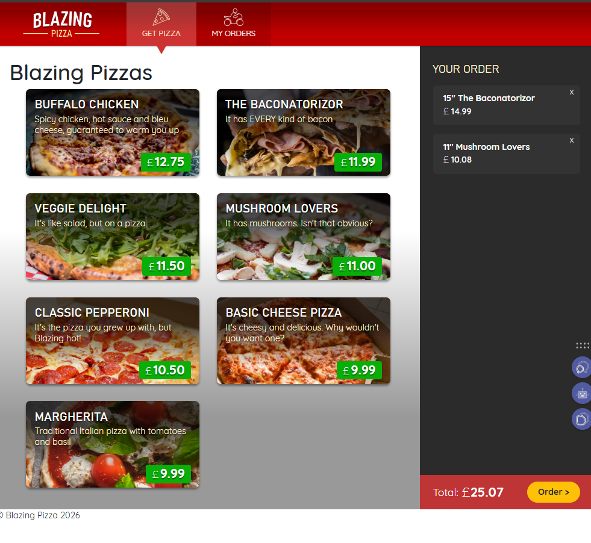

# Blazing Pizza - Navigation & Routing 🍕

This project represents an advanced iteration of the **Blazing Pizza** application, focusing specifically on **Blazor Navigation, Routing, and Layouts**. It demonstrates how to structure a complex, multi-page Single Page Application (SPA) using **.NET** and **C#**.

## 🚀 Features

* **Multi-Page Routing:** Implemented the `@page` directive to create distinct views for Home, Checkout, My Orders, and Order Details.
* **Dynamic Route Parameters:** Enables users to track specific orders via URL parameters (e.g., `myorders/5`).
* **Layout Management:** Uses `MainLayout` to ensure a consistent look and feel (headers, navigation bars) across all pages.
* **Active Navigation Links:** Visual feedback for the current page using the `NavLink` component.
* **Programmatic Navigation:** Uses `NavigationManager` to redirect users automatically after placing an order.
* **Error Handling:** Displays a custom "Not Found" message when users try to access an invalid order ID.

## 📸 Application Screenshots

### 1. Home Page
*The main landing page where users can browse specials and start an order.*


### 2. Checkout Page
*A dedicated route for reviewing the order, showcasing navigation away from the home page.*


### 3. My Orders List
*A page that lists past orders, serving as a hub for navigation to specific details.*


### 4. Order Details (Route Parameters)
*Demonstrates dynamic routing where the page content changes based on the Order ID in the URL.*


### 5. Order Not Found (Error Handling)
*A custom UI displayed when navigating to a non-existent order, ensuring a good user experience.*


### 6. App Layout & Setup
*The overall structure and layout of the application.*


## 🛠️ Technologies & Concepts Learned

* **Framework:** ASP.NET Core Blazor
* **Navigation:** `NavigationManager`, `NavLink`
* **Routing:** `@page` directives, Route constraints, Fallback routes
* **Layouts:** `LayoutComponentBase`, nested layouts
* **Language:** C#
* **Frontend:** HTML5, CSS, Razor Syntax

## 📦 Getting Started

To run this application locally:

1.  **Clone the repository:**
    ```bash
    git clone https://github.com/marius2347/BlazingPizza-using-Blazor-Navigation-.NET-in-CSharp.git
    ```
2.  **Navigate to the project directory:**
    ```bash
    cd BlazingPizza-using-Blazor-Navigation-.NET-in-CSharp
    ```
3.  **Run the application:**
    ```bash
    dotnet run
    ```
4.  Open your browser and navigate to the localhost URL shown in the terminal.

## 📬 Contact

If you have any questions about this project, feel free to reach out:

* **Email:** [mariusc0023@gmail.com](mailto:mariusc0023@gmail.com)
